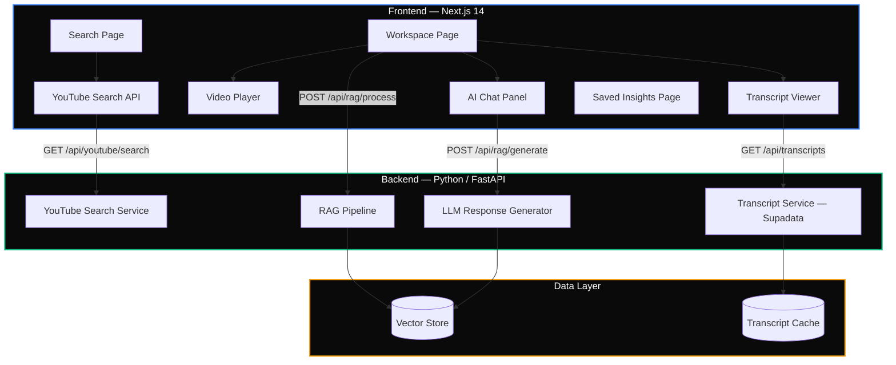

<div align="center">

<!-- BANNER: Replace with your generated banner image -->
<!-- Image generation prompt is at the bottom of this file -->


# PodSearch

**Search YouTube podcasts. Chat with their transcripts. Get timestamped answers.**

[](https://nextjs.org/)
[](https://www.typescriptlang.org/)
[](https://tailwindcss.com/)
[](LICENSE)

[Features](#features) · [Architecture](#architecture) · [Quick Start](#quick-start) · [API Reference](#api-reference) · [Contributing](#contributing)

</div>

---

## About

PodSearch is a web application that lets you search YouTube podcasts by topic, import episodes, and have AI-powered conversations about their content — complete with timestamped references back to the original video. Stop scrubbing through hours of audio. Just ask.

---

## Features

| Feature | Description |
|:--------|:------------|
| **Smart Search** | Search YouTube podcasts by keywords with duration filters and sorting by relevance, date, or views |
| **AI Chat** | Ask natural-language questions about any episode and get context-aware answers |
| **Timestamped Answers** | Every AI response links back to the exact moment in the video |
| **Integrated Player** | Watch the episode in an embedded player while chatting alongside it |
| **Saved Insights** | Bookmark Q&A pairs and organize them for later reference |
| **Insight Stats** | Track saved insights count and search through your collection |

---

## Architecture



### How It Works

```
┌──────────────┐     ┌──────────────┐     ┌──────────────┐
│   1. SEARCH  │────▶│  2. IMPORT   │────▶│   3. CHAT    │
│              │     │              │     │              │
│ Find podcast │     │ Fetch & proc │     │ Ask anything │
│ episodes on  │     │ transcript   │     │ about the    │
│ YouTube      │     │ through RAG  │     │ episode      │
└──────────────┘     └──────────────┘     └──────────────┘
```

---

## Quick Start

### Prerequisites

- **Node.js** 18+ and npm/yarn
- PodSearch backend running on `localhost:8000`

### Installation

```bash
# Clone the repository
git clone https://github.com/yourusername/podsearch.git
cd podsearch

# Install dependencies
npm install

# Configure environment
cp .env.example .env.local
```

Edit `.env.local`:

```env
NEXT_PUBLIC_API_URL=http://localhost:8000
```

### Run

```bash
# Development
npm run dev          # → http://localhost:3000

# Production
npm run build
npm start
```

---

## Project Structure

```
src/
├── app/                        # Next.js App Router
│   ├── page.tsx               # Home — search landing
│   ├── search/                # Search results grid
│   ├── workspace/[videoId]/   # Video workspace (player + chat + transcript)
│   └── saved/                 # Saved insights library
│
├── components/
│   ├── Layout.tsx             # Shell layout with navigation
│   └── ui/                    # Reusable UI primitives
│
├── lib/
│   └── api.ts                 # API client — all backend calls
│
├── store/
│   └── useStore.ts            # Zustand global state
│
└── types/
    └── api.ts                 # Shared TypeScript interfaces
```

---

## API Reference

| Method | Endpoint | Description |
|:-------|:---------|:------------|
| `GET` | `/api/youtube/search?q={query}` | Search YouTube for podcast episodes |
| `GET` | `/api/transcripts/transcript-supadata/{id}` | Fetch transcript for a video |
| `POST` | `/api/rag/process/{id}` | Process and index transcript for RAG |
| `POST` | `/api/rag/generate/{id}` | Generate AI answer from transcript context |

---

## Tech Stack

| Layer | Technology |
|:------|:-----------|
| Framework | Next.js 14 (App Router) |
| Language | TypeScript |
| Styling | Tailwind CSS |
| State | Zustand |
| Video | React Player |
| Icons | Lucide React |

---

## Contributing

1. Fork the repository
2. Create your feature branch → `git checkout -b feat/amazing-feature`
3. Commit your changes → `git commit -m "feat: add amazing feature"`
4. Push to the branch → `git push origin feat/amazing-feature`
5. Open a Pull Request

---

## License

This project is part of the PodSearch platform. See [LICENSE](LICENSE) for details.

---

<div align="center">

**[Back to Top](#podsearch)**

</div>

---

<!-- 
IMAGE GENERATION PROMPT (for Gemini / Midjourney / DALL-E):

"Create a wide banner image (1200x400px) for a GitHub repository called 'PodSearch'. 
The design should feature a dark gradient background (deep navy #0a0a0a to dark blue #1e3a5f). 
In the center, show a stylized podcast microphone icon morphing into a magnifying glass, 
surrounded by subtle waveform visualizations and floating chat bubbles with timestamp markers. 
Use accent colors: electric blue (#3b82f6) and emerald green (#10b981). 
The word 'PodSearch' should appear in a clean, modern sans-serif font (like SF Pro or Geist). 
Below it, a subtle tagline: 'Search. Listen. Ask.' 
Style: minimal, techy, clean — similar to Vercel or Linear branding. No gradients that look AI-generated."
-->
