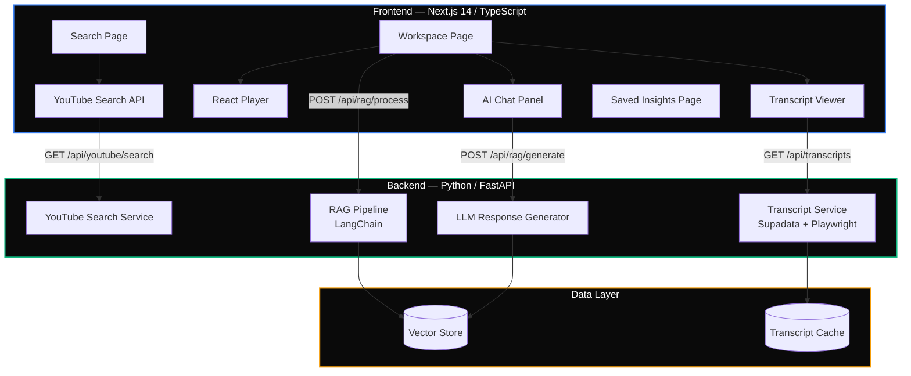

<div align="center">

# PodSearch

**Search YouTube podcasts. Chat with their transcripts. Get timestamped answers.**

[](https://nextjs.org/)
[](https://fastapi.tiangolo.com/)
[](https://www.langchain.com/)
[](https://www.typescriptlang.org/)
[](https://www.python.org/)
[](https://tailwindcss.com/)
[](LICENSE)

[Features](#features) · [Architecture](#architecture) · [Quick Start](#quick-start) · [API Reference](#api-reference) · [Contributing](#contributing)

</div>

---

## About

PodSearch is a full-stack application that lets you search YouTube podcasts by topic, import episodes, and have AI-powered conversations about their content — complete with timestamped references back to the original video. The backend uses LangChain for RAG orchestration, Playwright for web scraping, and FastAPI to serve everything. Stop scrubbing through hours of audio. Just ask.

---

## Features

| Feature | Description |
|:--------|:------------|
| **Smart Search** | Search YouTube podcasts by keywords with duration filters and sorting by relevance, date, or views |
| **AI Chat** | Ask natural-language questions about any episode and get context-aware answers powered by LangChain RAG |
| **Timestamped Answers** | Every AI response links back to the exact moment in the video |
| **Integrated Player** | Watch the episode in an embedded player while chatting alongside it |
| **Transcript Scraping** | Automated transcript extraction using Playwright and Supadata |
| **Saved Insights** | Bookmark Q&A pairs and organize them for later reference |
| **Insight Stats** | Track saved insights count and search through your collection |

---

## Architecture



### How It Works

```
┌──────────────┐     ┌──────────────┐     ┌──────────────┐
│   1. SEARCH  │────▶│  2. IMPORT   │────▶│   3. CHAT    │
│              │     │              │     │              │
│ Find podcast │     │ Fetch & proc │     │ Ask anything │
│ episodes on  │     │ transcript   │     │ about the    │
│ YouTube      │     │ via RAG      │     │ episode      │
└──────────────┘     └──────────────┘     └──────────────┘
```

---

## Quick Start

### Prerequisites

- **Node.js** 18+ and npm/yarn
- **Python** 3.10+
- Playwright browsers installed (`playwright install`)

### Frontend

```bash
cd frontend
npm install
cp .env.example .env.local
```

Edit `.env.local`:

```env
NEXT_PUBLIC_API_URL=http://localhost:8000
```

```bash
npm run dev          # → http://localhost:3000
```

### Backend

```bash
cd backend
python -m venv .venv
source .venv/bin/activate
pip install -r requirements.txt

# Install Playwright browsers
playwright install
```

```bash
uvicorn app.main:app --reload    # → http://localhost:8000
```

---

## Project Structure

```
├── frontend/                       # Next.js App Router
│   ├── app/
│   │   ├── page.tsx               # Home — search landing
│   │   ├── search/                # Search results grid
│   │   ├── workspace/[videoId]/   # Video workspace (player + chat + transcript)
│   │   └── saved/                 # Saved insights library
│   │
│   ├── components/
│   │   ├── Layout.tsx             # Shell layout with navigation
│   │   └── ui/                    # Reusable UI primitives
│   │
│   ├── lib/
│   │   └── api.ts                 # API client — all backend calls
│   │
│   ├── store/
│   │   └── useStore.ts            # Zustand global state
│   │
│   └── types/
│       └── api.ts                 # Shared TypeScript interfaces
│
└── backend/                        # FastAPI / Python
    ├── app/
    │   ├── main.py                # FastAPI entry point
    │   ├── routers/               # API route definitions
    │   ├── services/
    │   │   ├── youtube.py         # YouTube search integration
    │   │   ├── transcript.py      # Transcript fetching (Supadata + Playwright)
    │   │   └── rag.py             # LangChain RAG pipeline
    │   └── core/
    │       └── config.py          # Environment and settings
    └── requirements.txt
```

---

## API Reference

| Method | Endpoint | Description |
|:-------|:---------|:------------|
| `GET` | `/api/youtube/search?q={query}` | Search YouTube for podcast episodes |
| `GET` | `/api/transcripts/transcript-supadata/{id}` | Fetch transcript for a video |
| `POST` | `/api/rag/process/{id}` | Process and index transcript for RAG |
| `POST` | `/api/rag/generate/{id}` | Generate AI answer from transcript context |

---

## Tech Stack

### Frontend

| Layer | Technology |
|:------|:-----------|
| Framework | Next.js 14 (App Router) |
| Language | TypeScript |
| Styling | Tailwind CSS |
| State Management | Zustand |
| Video Player | React Player |
| Icons | Lucide React |

### Backend

| Layer | Technology |
|:------|:-----------|
| Framework | FastAPI |
| Language | Python |
| RAG Orchestration | LangChain |
| Web Scraping | Playwright |
| Transcript Source | Supadata API |
| Vector Store | Used for transcript indexing and retrieval |

---

## Contributing

1. Fork the repository
2. Create your feature branch → `git checkout -b feat/amazing-feature`
3. Commit your changes → `git commit -m "feat: add amazing feature"`
4. Push to the branch → `git push origin feat/amazing-feature`
5. Open a Pull Request

---

## License

This project is part of the PodSearch platform. See [LICENSE](LICENSE) for details.

---

<div align="center">

**[Back to Top](#podsearch)**

</div>
